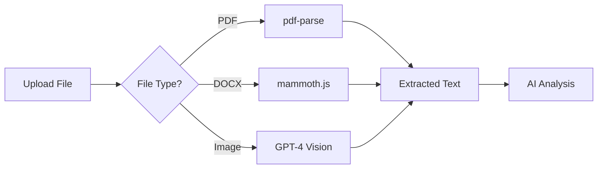

# 📊 Travel Itinerary Analyzer - Complete Documentation

A powerful AI-powered travel itinerary comparison and analysis platform with **Hybrid RAG** (Retrieval-Augmented Generation) capabilities.

---

## 🌟 Features Overview

### Core Features
| Feature | Description |
|---------|-------------|
| 📄 **Multi-format Upload** | Supports PDF, Word (DOCX), and Images |
| 🔍 **AI Analysis** | Extracts structured data from itineraries |
| ⚖️ **Comparison** | Side-by-side comparison of multiple itineraries |
| 💡 **Smart Insights** | RAG-enhanced strategic recommendations |
| 💬 **Q&A Chat** | Ask questions about your documents |
| 🌍 **Bilingual Support** | English (Roboto Slab) & Thai (Sarabun) fonts |

### Advanced RAG Features
| Feature | Description |
|---------|-------------|
| 📚 **Knowledge Base** | Store and index documents for retrieval |
| 🔗 **Hybrid Search** | Combines vector similarity + graph traversal |
| 🇹🇭 **Thai RAG** | Optimized embedding for Thai documents |
| 🖼️ **Multimodal** | Process images with GPT-4 Vision |

---

## 🏗️ Architecture

```
┌─────────────────────────────────────────────────────────────┐
│                     Frontend (React + Vite)                  │
├─────────────────────────────────────────────────────────────┤
│  ┌─────────────┐  ┌─────────────┐  ┌─────────────────────┐  │
│  │  Upload     │  │  Analysis   │  │  Knowledge Base     │  │
│  │  Component  │  │  Output     │  │  Manager            │  │
│  └─────────────┘  └─────────────┘  └─────────────────────┘  │
├─────────────────────────────────────────────────────────────┤
│                      Services Layer                          │
│  ┌──────────┐ ┌──────────┐ ┌──────────┐ ┌───────────────┐   │
│  │ AI       │ │ File     │ │ Arango   │ │ Thai RAG      │   │
│  │ Service  │ │ Parser   │ │ Service  │ │ Service       │   │
│  └──────────┘ └──────────┘ └──────────┘ └───────────────┘   │
├─────────────────────────────────────────────────────────────┤
│                     External Services                        │
│  ┌──────────────┐  ┌──────────────┐  ┌──────────────────┐   │
│  │   OpenAI     │  │   ArangoDB   │  │   ChromaDB       │   │
│  │   GPT-4o     │  │   (Hybrid)   │  │   (Backup)       │   │
│  └──────────────┘  └──────────────┘  └──────────────────┘   │
└─────────────────────────────────────────────────────────────┘
```

---

## 📁 Project Structure

```
itin-analyzer/
├── components/              # React UI components
│   ├── AnalysisOutput.tsx   # Main output container
│   ├── InsightsView.tsx     # RAG-enhanced insights display
│   ├── ComparisonView.tsx   # Side-by-side comparison
│   ├── QnaView.tsx          # Q&A chat interface
│   ├── KnowledgeBase.tsx    # KB management UI
│   ├── RagProgressOverlay.tsx # Loading overlay
│   └── icons/               # SVG icon components
│
├── services/                # Business logic services
│   ├── aiService.ts         # OpenAI API integration
│   ├── arangoService.ts     # ArangoDB Hybrid RAG
│   ├── thaiRagService.ts    # Thai language processing
│   ├── fileParser.ts        # PDF/DOCX/Image parsing
│   ├── multimodalRagService.ts # GPT-4 Vision
│   ├── dbService.ts         # IndexedDB local storage
│   └── exportService.ts     # PDF/Excel export
│
├── utils/                   # Utility functions
│   └── markdownRenderer.tsx # Markdown to React
│
├── App.tsx                  # Main application component
├── types.ts                 # TypeScript type definitions
├── index.html               # HTML entry point
├── index.css                # Global styles
├── vite.config.ts           # Vite configuration
├── docker-compose.yml       # Docker services
└── .env                     # Environment variables
```

---

## 🔄 How It Works

### 1. Document Upload & Parsing



**Supported formats:**
- **PDF**: Uses `pdfjs-dist` for text extraction
- **Word**: Uses `mammoth` for DOCX parsing
- **Images**: Uses GPT-4 Vision for OCR

### 2. AI Analysis Flow

When you click "Analyze & Compare":

1. **Text Extraction** → Parse uploaded files
2. **Structured Analysis** → GPT-4o extracts:
   - Tour name, duration, destinations
   - Pricing breakdown
   - Inclusions/exclusions
   - Day-by-day itinerary
3. **Comparison** → Generate side-by-side table
4. **Geocoding** → Map destinations

### 3. Knowledge Base & RAG

```
┌──────────────────────────────────────────────────────────┐
│                    RAG Pipeline                           │
├──────────────────────────────────────────────────────────┤
│                                                          │
│  1. INDEXING (Upload to KB)                              │
│     ┌─────────┐   ┌─────────┐   ┌─────────┐             │
│     │ Chunk   │ → │ Embed   │ → │ Store   │             │
│     │ Text    │   │ Vectors │   │ ArangoDB│             │
│     └─────────┘   └─────────┘   └─────────┘             │
│          ↓                                               │
│     ┌─────────┐   ┌─────────┐                           │
│     │ Extract │ → │ Build   │                           │
│     │ Entities│   │ Graph   │                           │
│     └─────────┘   └─────────┘                           │
│                                                          │
│  2. RETRIEVAL (Get Insights / Q&A)                       │
│     ┌─────────┐   ┌─────────────────────┐               │
│     │ Query   │ → │ Hybrid Search       │               │
│     │ Embed   │   │ (Vector + Graph)    │               │
│     └─────────┘   └─────────────────────┘               │
│                           ↓                              │
│     ┌─────────────────────────────────────┐             │
│     │ LLM Generate Answer with Context    │             │
│     └─────────────────────────────────────┘             │
│                                                          │
└──────────────────────────────────────────────────────────┘
```

### 4. Language Detection

The app automatically detects Thai text and applies appropriate processing:

| Detection | Embedding Model | Font |
|-----------|-----------------|------|
| 🇺🇸 English | OpenAI `text-embedding-3-small` | Roboto Slab |
| 🇹🇭 Thai | OpenThaiGPT or Thai-preprocessed | Sarabun |
| 🌐 Mixed | Smart hybrid embedding | Both |

---

## ⚙️ Configuration

### Environment Variables (.env)

```env
# Required: OpenAI API Key
OPENAI_API_KEY=sk-proj-your_key_here

# ArangoDB (Hybrid RAG)
ARANGO_URL=http://localhost:8529
ARANGO_USER=root
ARANGO_PASSWORD=password123
ARANGO_DATABASE=itinerary_kb

# ChromaDB (Backup vector store)
CHROMA_URL=http://localhost:8000

# Optional: Thai RAG
OPENTHAI_ENABLED=false
OPENTHAI_API_URL=http://localhost:5000
```

### Docker Services

```yaml
services:
  dev:           # Vite dev server (port 3000)
  arangodb:      # Hybrid RAG database (port 8529)
  chromadb:      # Vector backup (port 8000)
```

---

## 🚀 Getting Started

### Prerequisites
- Node.js 18+
- Docker & Docker Compose
- OpenAI API Key

### Quick Start

```bash
# 1. Clone the repository
git clone https://github.com/SSaksit23/package-tour-comparison.git
cd package-tour-comparison

# 2. Copy environment file
cp env.example .env
# Edit .env and add your OPENAI_API_KEY

# 3. Start with Docker
docker-compose up -d

# 4. Open browser
# http://localhost:3000
```

### Development Mode

```bash
# Install dependencies
npm install

# Start dev server only
npm run dev

# Or start with databases
docker-compose up arangodb chromadb -d
npm run dev
```

---

## 📊 Usage Guide

### Basic Workflow

1. **Upload Itineraries**
   - Drag & drop PDF/DOCX/Images into upload zones
   - Add competitor names for each itinerary

2. **Analyze**
   - Click "Analyze & Compare"
   - View structured data, comparison table, insights

3. **Build Knowledge Base** (for RAG)
   - Click "Knowledge Base" button
   - Upload reference documents
   - Wait for indexing (check console logs)

4. **Get Enhanced Insights**
   - With KB populated, click "Get Insights"
   - System searches KB for relevant context
   - Generates RAG-enhanced recommendations

5. **Q&A**
   - Ask questions about your documents
   - System uses hybrid search for answers

### Tips for Best Results

| Tip | Description |
|-----|-------------|
| 📚 **Populate KB First** | Upload similar itineraries to KB before analysis |
| 🇹🇭 **Thai Documents** | System auto-detects Thai and uses optimized processing |
| 📄 **File Size** | Keep files under 10MB for best performance |
| 💬 **Q&A Context** | More KB documents = better Q&A answers |

---

## 🔧 Troubleshooting

### Common Issues

| Issue | Solution |
|-------|----------|
| "No KB docs used" | Upload documents to Knowledge Base first |
| 409 Conflict errors | Normal - collections already exist |
| Embedding stuck | Check OpenAI API key and rate limits |
| Thai text garbled | Ensure Sarabun font is loaded |

### Checking Logs

```bash
# View Docker logs
docker-compose logs -f dev
docker-compose logs -f arangodb

# Browser console shows:
# ✅ ArangoDB Hybrid RAG initialized
# 📦 Knowledge Base: X chunks total
# 📚 RAG Context: Found X relevant documents
```

---

## 📝 API Reference

### AI Service Functions

```typescript
// Analyze itinerary text
analyzeItinerary(text: string, language: string): Promise<ItineraryData>

// Generate comparison table
getComparison(competitors: Competitor[], language: string): Promise<string>

// Get recommendations (with optional RAG context)
getRecommendations(
  competitors: Competitor[], 
  history: AnalysisRecord[], 
  language: string,
  ragContext?: string
): Promise<string>

// Q&A with RAG
generateAnswer(
  contexts: {name: string, text: string}[],
  question: string,
  chatHistory: ChatMessage[],
  language: string,
  ragContext?: string
): Promise<string>
```

### ArangoDB Service Functions

```typescript
// Index document in knowledge base
indexDocumentInArango(doc: Document): Promise<{chunks: number, entities: number}>

// Hybrid search (vector + graph)
hybridSearch(query: string, topK?: number): Promise<HybridSearchResult[]>

// RAG query with chat
arangoHybridQuery(
  question: string,
  chatHistory: ChatMessage[],
  language: string
): Promise<HybridRAGResponse>
```

---

## 🌐 Technologies Used

| Category | Technology |
|----------|------------|
| **Frontend** | React 18, TypeScript, Tailwind CSS |
| **Build** | Vite |
| **AI** | OpenAI GPT-4o, GPT-4 Vision |
| **Vector DB** | ArangoDB (primary), ChromaDB (backup) |
| **Graph** | ArangoDB Graph |
| **PDF** | pdfjs-dist |
| **Word** | mammoth.js |
| **Maps** | Leaflet |
| **Fonts** | Roboto Slab, Sarabun |
| **Container** | Docker, Docker Compose |

---

## 📄 License

MIT License - See LICENSE file for details.

---

## 👨‍💻 Author

Created by **Saksit Saelow**

---

*Last updated: December 2024*

